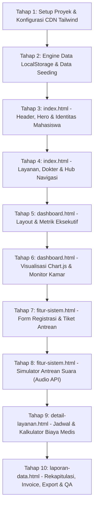

# PRODUCT REQUIREMENT DOCUMENT (PRD)

## SISTEM INFORMASI MANAJEMEN RUMAH SAKIT & KLINIK TERPADU: KLINIKA.ID

---

| Metadata Proyek           | Keterangan                                                                              |
| :------------------------ | :-------------------------------------------------------------------------------------- |
| **Nama Produk / Brand**   | **Klinika.id**                                                                          |
| **Kategori Sistem**       | _Hospital & Clinic Management System (HCMS)_                                            |
| **Target Platform**       | Web Responsive (Desktop, Tablet, Mobile)                                                |
| **Arsitektur Sistem**     | Multi-Page Application (MPA) Client-Side — 5 Modul HTML Terpadu                         |
| **Framework & Tools**     | Tailwind CSS CDN, FontAwesome 6 CDN, Chart.js CDN, Google Fonts                         |
| **Penyimpanan Data**      | Browser `localStorage` API (Zero-Backend, Portable, Real-Time Sync)                     |
| **Standar Keamanan SEO**  | Wajib Tag `<meta name="robots" content="noindex, nofollow">` pada seluruh file          |
| **Tema Desain Referensi** | _MedService Style_ (Clean Medical Aesthetic: Steel Blue, Royal Blue, White, Slate Grey) |

---

## DAFTAR ISI

1. [Ringkasan Eksekutif & Identitas Proyek](#1-ringkasan-eksekutif--identitas-proyek)
2. [Profil Pengguna & Kebutuhan Bisnis](#2-profil-pengguna--kebutuhan-bisnis)
3. [Design System & UI/UX Guidelines (Gaya MedService)](#3-design-system--uiux-guidelines-gaya-medservice)
4. [Arsitektur Teknis, CDN & Standar Keamanan](#4-arsitektur-teknis-cdn--standar-keamanan)
5. [Struktur Data & Skema LocalStorage](#5-struktur-data--skema-localstorage)
6. [Spesifikasi Fungsional 5 File HTML](#6-spesifikasi-fungsional-5-file-html)
   - [6.1 index.html — Landing Page & Portal Hub Utama](#61-indexhtml--landing-page--portal-hub-utama)
   - [6.2 dashboard.html — Tampilan Utama Sistem (Executive HCMS Dashboard)](#62-dashboardhtml--tampilan-utama-sistem-executive-hcms-dashboard)
   - [6.3 fitur-sistem.html — Modul Fitur Interaktif (Pendaftaran Pasien & Antrean Cerdas)](#63-fitur-sistemhtml--modul-fitur-interaktif-pendaftaran-pasien--antrean-cerdas)
   - [6.4 detail-layanan.html — Modul Fitur Pendukung (Katalog Medis & Kalkulator Biaya)](#64-detail-layananhtml--modul-fitur-pendukung-katalog-medis--kalkulator-biaya)
   - [6.5 laporan-data.html — Modul Rekapitulasi & Riwayat Transaksi](#65-laporan-datahtml--modul-rekapitulasi--riwayat-transaksi)
7. [Rencana 10 Tahapan Development (Build Prompts)](#7-rencana-10-tahapan-development-build-prompts)
8. [Matriks Verifikasi & Kriteria Keberhasilan (Quality Assurance)](#8-matriks-verifikasi--kriteria-keberhasilan-quality-assurance)

---

## 1. RINGKASAN EKSEKUTIF & IDENTITAS PROYEK

### 1.1 Latar Belakang

**Klinika.id** adalah platform digital manajemen rumah sakit dan klinik modern yang dirancang untuk menjawab tantangan operasional fasilitas kesehatan: antrean pasien yang tidak teratur, transparansi estimasi biaya tindakan medis yang minim, pengelolaan jadwal praktik dokter yang dinamis, serta perlunya dashboard monitoring eksekutif yang akurat.

Sistem ini menggabungkan dua ekosistem dalam satu aplikasi web:

1. **Public Medical Portal (Front-Facing):** Media informasi komprehensif bagi calon pasien, mencakup profil poliklinik, transparansi jadwal dokter, simulasi estimasi biaya mandiri, dan booking antrean secara cepat.
2. **Clinical Management Dashboard (Operational-Facing):** Media kerja terpadu bagi petugas medis, staf loket pendaftaran, dan manajemen rumah sakit untuk memonitor keterisian tempat tidur (BOR), volume antrean poli, riwayat transaksi, hingga pencetakan invoice resmi.

### 1.2 Identitas Mahasiswa & Pengembang (Elemen Wajib Akademik)

Setiap tampilan halaman publik (terutama pada `index.html`) dilengkapi dengan widget / badge terstandarisasi untuk kebutuhan presentasi dan evaluasi akademik:

- **Nama Pengembang:** `[Nama Mahasiswa / Pengembang]`
- **Nomor Induk Mahasiswa (NIM):** `[NIM Mahasiswa]`
- **Program Studi & Kelas:** `[Teknik Informatika / Sistem Informasi - Kelas XYZ]`
- **Mata Kuliah / Tugas:** `[Pemrograman Web / Sistem Informasi Kesehatan]`
- **Indikator Status Deployment Cloud:** Badge Interaktif berstatus _Live on Netlify_ dengan indikator hijau berkedip (_pulsing green status_).

---

## 2. PROFIL PENGGUNA & KEBUTUHAN BISNIS

| Persona Pengguna                        | Tanggung Jawab & Skenario Penggunaan                                                                       | Kebutuhan Utama pada Klinika.id                                                                                                       |
| :-------------------------------------- | :--------------------------------------------------------------------------------------------------------- | :------------------------------------------------------------------------------------------------------------------------------------ |
| **Pasien / Keluarga Pasien**            | Mencari informasi dokter, memperkirakan biaya medis, dan mendaftar antrean agar tidak menunggu lama di RS. | - Akses jadwal dokter per poliklinik.<br>- Kalkulator biaya tindakan & kamar rawat.<br>- Pendaftaran mandiri & tiket antrean digital. |
| **Petugas Resepsionis / Loket Antrean** | Melayani registrasi pasien datang langsung (walk-in) dan memanggil nomor antrean ruang tunggu.             | - Form pendaftaran cepat dengan auto-generate No. RM.<br>- Tombol pemanggil antrean bersuara otomatis (_Web Speech API_).             |
| **Dokter & Tenaga Medis**               | Mengetahui jumlah pasien yang menunggu di poliklinik dan mengonfirmasi penyelesaian konsultasi.            | - Monitor status antrean poli secara realtime.<br>- Mengubah status antrean menjadi "Sedang Dilayani" atau "Selesai".                 |
| **Kasir & Manajemen RS**                | Mengelola tagihan pasien, mencetak kuitansi pembayaran, dan memonitor pendapatan harian serta BOR.         | - Dashboard metrik harian (Kunjungan, BOR %, Revenue).<br>- Tabel rekap transaksi dengan fitur cetak kuitansi & ekspor CSV.           |

---

## 3. DESIGN SYSTEM & UI/UX GUIDELINES (GAYA MEDSERVICE)

Desain **Klinika.id** mengadopsi estetika medis dari referensi **MedService**: perpaduan warna biru tua baja (_steel blue_), biru medis (_medical royal blue_), aksen hijau toska/sian, latar belakang abu-abu terang yang higienis, serta kartu putih berbayang halus (_subtle card shadows_).

### 3.1 Skema Warna (Color Palette)

```
[#1b68b3] Primary Medical Blue   --> Header strip, tombol utama, icon badges
[#23356e] Deep Steel Blue        --> Judul heading, typography utama, navbar brand
[#0ea5e9] Medical Sky / Cyan     --> Hover states, aksen aktif, grafik sekunder
[#f8fafc] Clean Clinical Light   --> Background halaman (body background)
[#ffffff] Pure Sterile White     --> Card containers, modals, table surfaces
[#10b981] Health Success Emerald --> Status "Selesai", "Tersedia", "Lunas", Netlify Live
[#f59e0b] Clinical Alert Amber   --> Status "Menunggu", "Dalam Pemeriksaan", "Perhatian"
[#ef4444] Emergency Crimson Red  --> Status "Darurat 24/7", "Penuh", "Batal"
```

### 3.2 Konfigurasi Tailwind CSS CDN (In-Page Script Config)

Seluruh file HTML menginisialisasi konfigurasi kustom Tailwind CSS melalui tag skrip CDN:

```html
<script src="https://cdn.tailwindcss.com"></script>
<script>
  tailwind.config = {
    theme: {
      extend: {
        colors: {
          "med-blue": "#1b68b3",
          "med-dark": "#23356e",
          "med-light": "#f8fafc",
          "med-cyan": "#0ea5e9",
          "med-border": "#e2e8f0",
          "med-emerald": "#10b981",
          "med-amber": "#f59e0b",
          "med-rose": "#ef4444",
        },
        fontFamily: {
          sans: ["Roboto", "Lato", "sans-serif"],
        },
      },
    },
  };
</script>
```

### 3.3 Tipografi & Ikonografi

- **Google Fonts:**
  - Font Utama: `Roboto` (Weights: 300, 400, 500, 700) untuk body text, data table, dan form.
  - Font Heading: `Lato` (Weights: 700, 900) untuk title, hero headline, dan metric cards.
- **FontAwesome 6 Icons (via CDN):**
  - `<i class="fas fa-stethoscope">` (Poli Umum / Dokter)
  - `<i class="fas fa-heartbeat">` (Kardiologi)
  - `<i class="fas fa-baby">` (Pediatri / Anak)
  - `<i class="fas fa-brain">` (Neurologi)
  - `<i class="fas fa-x-ray">` (Radiologi)
  - `<i class="fas fa-hospital-user">` (Pasien & Pendaftaran)
  - `<i class="fas fa-calculator">` (Kalkulator Biaya)
  - `<i class="fas fa-file-invoice-dollar">` (Billing & Transaksi)
  - `<i class="fas fa-ambulance">` (Layanan Darurat IGD)

### 3.4 Standar Asset Gambar (Cloud CDN)

Semua gambar wajib diambil dari CDN publik beresolusi tinggi dengan lisensi terbuka (Unsplash Medical Photography):

- Hero Doctor Portrait: `https://images.unsplash.com/photo-1622253692010-333f2da6031d?auto=format&fit=crop&w=800&q=80`
- Hospital Interior / Consultation: `https://images.unsplash.com/photo-1519494026892-80bbd2d6fd0d?auto=format&fit=crop&w=800&q=80`
- Medical Equipment & Lab: `https://images.unsplash.com/photo-1579684385127-1ef15d508118?auto=format&fit=crop&w=800&q=80`
- Doctor Avatars: Foto dokter pria dan wanita profesional berseragam medis standar.

---

## 4. ARSITEKTUR TEKNIS, CDN & STANDAR KEAMANAN

### 4.1 Dependency Manifesto (100% CDN, Zero Local Build Step)

Untuk menjamin portabilitas, kemudahan pengujian tanpa _bundler_ (Webpack/Vite), dan kompatibilitas penuh dengan hosting statis seperti Netlify / GitHub Pages:

| Kebutuhan          | Sumber CDN Terpercaya                                                                                            | Keterangan                        |
| :----------------- | :--------------------------------------------------------------------------------------------------------------- | :-------------------------------- |
| **CSS Styling**    | `https://cdn.tailwindcss.com`                                                                                    | Tailwind v3 runtime compilation   |
| **Ikon UI**        | `https://cdnjs.cloudflare.com/ajax/libs/font-awesome/6.4.0/css/all.min.css`                                      | FontAwesome 6 Free Solid & Brands |
| **Grafik & Chart** | `https://cdn.jsdelivr.net/npm/chart.js`                                                                          | Chart.js v4 UMD bundle            |
| **Font Medis**     | `https://fonts.googleapis.com/css2?family=Lato:wght@400;700;900&family=Roboto:wght@300;400;500;700&display=swap` | Google Web Fonts CDN              |

### 4.2 Tag Wajib Keamanan & SEO

Setiap file HTML **WAJIB** menyertakan meta tag keamanan berikut di dalam blok `<head>` untuk mencegah indeksasi oleh bot perayap mesin pencari (_search crawler_) terhadap aplikasi simulasi medis internal:

```html
<meta name="robots" content="noindex, nofollow" />
```

Struktur `<head>` standar pada setiap file:

```html
<!DOCTYPE html>
<html lang="id">
  <head>
    <meta charset="UTF-8" />
    <meta name="viewport" content="width=device-width, initial-scale=1.0" />
    <meta http-equiv="X-UA-Compatible" content="IE=edge" />
    <meta name="robots" content="noindex, nofollow" />
    <title>Klinika.id - [Nama Halaman / Modul]</title>
    <link
      rel="shortcut icon"
      href="https://img.icons8.com/color/48/hospital-2.png"
      type="image/x-icon"
    />
    <!-- Fonts & CDN CSS -->
    <link rel="preconnect" href="https://fonts.googleapis.com" />
    <link rel="preconnect" href="https://fonts.gstatic.com" crossorigin />
    <link
      href="https://fonts.googleapis.com/css2?family=Lato:wght@400;700;900&family=Roboto:wght@300;400;500;700&display=swap"
      rel="stylesheet"
    />
    <link
      rel="stylesheet"
      href="https://cdnjs.cloudflare.com/ajax/libs/font-awesome/6.4.0/css/all.min.css"
    />
    <script src="https://cdn.tailwindcss.com"></script>
    <!-- Tailwind Theme Configuration -->
    <script>
      /* konfigurasi warna med-blue, med-dark, dll */
    </script>
  </head>
</html>
```

---

## 5. STRUKTUR DATA & SKEMA LOCALSTORAGE

Untuk menghadirkan pengalaman dinamis antar 5 file HTML tanpa backend database, sistem menggunakan **Klinika Data Engine** berbasis `window.localStorage`. Apabila data belum tersedia, sistem secara otomatis mengisi (_data seeding_) data contoh realistis.

### 5.1 Kunci Penyimpanan (Storage Keys)

| Storage Key            | Tipe Data       | Deskripsi                                                 |
| :--------------------- | :-------------- | :-------------------------------------------------------- |
| `klinika_queues`       | `Array<Object>` | Antrean aktif & riwayat registrasi antrean poliklinik     |
| `klinika_transactions` | `Array<Object>` | Riwayat tagihan medis, billing kasir, dan pembayaran      |
| `klinika_doctors`      | `Array<Object>` | Master direktori dokter, poli, jadwal, tarif, dan foto    |
| `klinika_rooms`        | `Array<Object>` | Ketersediaan tempat tidur (BOR) rawat inap                |
| `klinika_services`     | `Array<Object>` | Katalog tindakan medis, paket MCU, laboratorium, dan obat |

### 5.2 Skema Data Detail

```json
// Contoh Struktur Objek: klinika_queues
{
  "id": "Q-20260923-001",
  "queueNumber": "A-012",
  "polyCode": "POLI-UMUM",
  "polyName": "Poli Umum",
  "patientName": "Budi Santoso",
  "patientNik": "3201123456780001",
  "patientPhone": "081234567890",
  "gender": "Laki-laki",
  "doctorName": "dr. Jonathan Barnes, Sp.PD",
  "paymentMethod": "BPJS",
  "timestamp": "2026-09-23T08:30:00Z",
  "status": "Menunggu", // 'Menunggu', 'Dipanggil', 'Dilayani', 'Selesai', 'Batal'
  "estimatedTime": "09:00 WIB"
}

// Contoh Struktur Objek: klinika_transactions
{
  "invoiceId": "INV-KLN-2026-089",
  "queueNumber": "A-012",
  "patientName": "Budi Santoso",
  "polyName": "Poli Penyakit Dalam",
  "doctorName": "dr. Jonathan Barnes, Sp.PD",
  "date": "2026-09-23",
  "items": [
    { "name": "Konsultasi Dokter Spesialis", "cost": 150000 },
    { "name": "Pemeriksaan Darah Lengkap", "cost": 120000 },
    { "name": "Paket Obat Antibiotik & Vitamin", "cost": 85000 }
  ],
  "subtotal": 355000,
  "discountCover": 355000, // Jika ditanggung BPJS
  "totalDue": 0,
  "paymentMethod": "BPJS Kesehatan",
  "paymentStatus": "Lunas" // 'Lunas', 'Tertunda', 'Klaim Asuransi'
}
```

---

## 6. SPESIFIKASI FUNGSIONAL 5 FILE HTML

Sistem terbagi secara presisi menjadi 5 file HTML dengan fungsi spesifik yang saling terhubung melalui _Navigation Bar_ dan _Shared Data Engine_.

```
[index.html] ----------> Portal Utama, Profil Klinik, Status Netlify, Identitas Mahasiswa
      |
      +---> [dashboard.html] ------> Metrik Eksekutif, Grafik Kunjungan, Antrean Live, Kapasitas Kamar
      |
      +---> [fitur-sistem.html] ---> Form Pendaftaran, Cetak Tiket, Simulator Pemanggil Suara
      |
      +---> [detail-layanan.html] -> Jadwal Dokter Praktik, Katalog Poli, Kalkulator Biaya Medis
      |
      +---> [laporan-data.html] ---> Rekap Pasien, Riwayat Billing, Modal Kuitansi, Export CSV
```

---

### 6.1 `index.html` — Landing Page & Portal Hub Utama

#### A. Tujuan & Karakteristik

Halaman gerbang utama yang menyajikan identitas brand **Klinika.id** dengan gaya visual _MedService_, sekaligus berfungsi sebagai hub navigasi menuju 4 modul operasional lainnya, serta menampilkan data identitas mahasiswa pengembang dan status deployment cloud Netlify.

#### B. Komponen Wajib & Spesifikasi Rinci

1. **Top Header Strip (MedService Style):**
   - Baris biru tua di atas navigasi: Alamat klinik, nomor kontak darurat `(021) 800-KLINIK`, jam buka `Senin - Minggu 24 Jam`, dan tautan sosial media.
2. **Main Navigation Bar (Sticky & Responsive):**
   - Logo Klinika.id (Ikon Rumah Sakit + Teks Biru Baja dengan dot cyan).
   - Tautan navigasi aktif ke 5 file:
     - `Beranda` (`index.html` - Active state)
     - `Dashboard Sistem` (`dashboard.html`)
     - `Pendaftaran & Antrean` (`fitur-sistem.html`)
     - `Katalog & Kalkulator` (`detail-layanan.html`)
     - `Laporan & Rekapitulasi` (`laporan-data.html`)
   - Tombol Aksi Cepat: _"Buat Janji Temu"_ (Membuka modal pendaftaran cepat atau mengarahkan ke `fitur-sistem.html`).
   - Mobile Hamburger Menu yang responsif.
3. **Student Identity & Live Deployment Banner (Elemen Wajib Rubrik):**
   - Kotak informasi elegan di bawah navbar:
     - Avatar mahasiswa & lencana _"Sistem Informasi Manajemen Kesehatan"_.
     - Data Mahasiswa: Nama Lengkap, NIM, Program Studi, Kelas.
     - Badge Status Netlify: Lingkaran hijau berkedip (_pulsing animation_) dengan teks _"Netlify Deployment: Status Live / Operational"_.
4. **Hero Section (MedService Layout):**
   - Judul Besar: _"Pelayanan Medis Modern, Terpercaya & Terintegrasi Untuk Keluarga Anda"_.
   - Deskripsi Singkat: Pengenalan Klinika.id sebagai Smart Clinic berstandar internasional.
   - Dual Call-to-Action (CTA):
     - Tombol Primer: _"Akses Dashboard Manajemen"_ (Menuju `dashboard.html`).
     - Tombol Sekunder: _"Ambil Antrean Online"_ (Menuju `fitur-sistem.html`).
   - Foto Dokter Utama (Unsplash Cloud CDN) dalam bingkai melengkung modern dengan floating badge: _"100% Dokter Bersertifikasi"_.
5. **4 Quick Access Highlight Boxes:**
   - Box 1: _Jam Operasional Poli & IGD 24 Jam_ (Jadwal hari kerja & akhir pekan).
   - Box 2: _Jadwal Praktik Dokter_ (Tautan langsung ke `detail-layanan.html`).
   - Box 3: _Pendaftaran Mandiri & Tiket Antrean_ (Tautan langsung ke `fitur-sistem.html`).
   - Box 4: _Hotline Kasus Darurat (Emergency Call)_ dengan tombol panggil langsung.
6. **Hub Navigasi 5 Modul Aplikasi (Showcase Hub):**
   - Grid 4 kartu yang mengarahkan pengunjung ke 4 modul lainnya lengkap dengan preview fitur, ikon pembeda, dan tombol _Buka Modul_.
7. **Departemen & Layanan Unggulan (Tabs / Grid):**
   - Poli Anak (Pediatrics), Kardiologi (Jantung), Penyakit Dalam, Neurologi, Radiologi & MRI, Laboratorium Patologi.
8. **Profil Dokter Spesialis Unggulan:**
   - 4 Card Dokter dengan foto profesional, nama lengkap berspesialisasi, jam praktik, dan tombol profil/booking.
9. **Paket Pemeriksaan Kesehatan (Pricing Cards):**
   - Paket Medical Check-Up: Basic Screening, Executive Health, Paket Ibu & Anak.
10. **Statistik Rumah Sakit & Testimoni Pasien:**
    - Counter angka: 15.000+ Pasien Terlayani, 45+ Dokter Spesialis, 120 Tempat Tidur, 99.2% Kepuasan Pasien.
    - Carousel/Grid testimoni pasien dengan avatar dan rating bintang.
11. **Hospital Footer Lengkap:**
    - Deskripsi klinik, kontak darurat, formulir newsletter, legal disclaimer, dan hak cipta.

---

### 6.2 `dashboard.html` — Tampilan Utama Sistem (Executive HCMS Dashboard)

#### A. Tujuan & Karakteristik

Pusat komando operasional rumah sakit untuk manajemen, dokter jaga, dan kepala perawat. Menampilkan visualisasi data analitik kunjungan pasien, tingkat keterisian tempat tidur (_Bed Occupancy Rate_), pemantauan antrean langsung, dan ringkasan finansial.

#### B. Komponen Wajib & Spesifikasi Rinci

1. **Topbar & Sidebar Layout Terintegrasi:**
   - Sidebar navigasi ramping di sisi kiri (bisa di-collapse pada mobile) dengan indikator aktif pada menu `Dashboard`.
   - Topbar atas: Penunjuk Jam Realtime Digital (WIB), indikator status server, pencarian pasien instan, serta profil staf jaga (_dr. Jonathan Barnes - Chief Medical Officer_).
2. **4 Kartu Metrik Utama (Executive KPI Cards):**
   - **Metrik 1:** _Total Kunjungan Pasien Hari Ini_ (e.g. 142 Pasien, persentase kenaikan +12.5% dibanding kemarin).
   - **Metrik 2:** _Antrean Aktif Saat Ini_ (e.g. 18 Pasien dalam tunggu poli, indikator warna amber).
   - **Metrik 3:** _Bed Occupancy Rate (BOR)_ (e.g. 78% terisi dari 120 bed, progress bar dinamis).
   - **Metrik 4:** _Total Pendapatan Harian_ (e.g. Rp 28.450.000, rincian pembayaran BPJS vs Mandiri).
3. **Visualisasi Data Interaktif (Chart.js via CDN):**
   - **Grafik 1 (Line / Bar Chart):** _Tren Kunjungan Pasien 7 Hari Terakhir_ (Menampilkan perbandingan pasien umum vs pasien BPJS per hari).
   - **Grafik 2 (Doughnut / Polar Chart):** _Distribusi Beban Kerja Poliklinik_ (Persentase kunjungan di Poli Umum, Poli Gigi, Poli Anak, Poli Jantung, dan Poli Kandungan).
4. **Live Polyclinic Queue Status Board:**
   - Tabel realtime menampilkan nomor antrean yang sedang diperiksa di tiap ruangan poli:
     - Poli Umum (Loket 1): No. A-014 (dr. Sarah Wijaya) — Status: _Sedang Konsultasi_.
     - Poli Anak (Loket 2): No. B-008 (dr. Hendra Gunawan) — Status: _Pemeriksaan Fisik_.
     - Poli Gigi (Loket 3): No. C-005 (drg. Maya Putri) — Status: _Tindakan Medis_.
     - Poli Jantung (Loket 4): No. D-003 (dr. Jonathan Barnes) — Status: _Menunggu Pasien_.
5. **Bed Capacity & Ward Monitor (Kapasitas Tempat Tidur):**
   - Tampilan visual keterisian kamar rawat inap:
     - VVIP Room (Kapasitas: 10, Terisi: 8, Tersedia: 2)
     - VIP Room (Kapasitas: 25, Terisi: 20, Tersedia: 5)
     - Kelas 1 (Kapasitas: 40, Terisi: 32, Tersedia: 8)
     - Kelas 2 & 3 (Kapasitas: 35, Terisi: 28, Tersedia: 7)
     - ICU / NICU (Kapasitas: 10, Terisi: 7, Tersedia: 3)
6. **Aktivitas Terakhir & Emergency Feeds:**
   - Timeline log aktivitas: Pendaftaran pasien baru, panggilan kamar rawat, penerimaan resep di instalasi farmasi.

---

### 6.3 `fitur-sistem.html` — Modul Fitur Interaktif (Pendaftaran Pasien & Antrean Cerdas)

#### A. Tujuan & Karakteristik

Halaman kerja utama simulasi operasional antrean dan pendaftaran pasien baru. Memungkinkan input data pasien langsung, pencetakan tiket antrean digital, dan simulator konsol pemanggil antrean bersuara otomatis (_Audio-Visual Queue Controller_).

#### B. Komponen Wajib & Spesifikasi Rinci

1. **Formulir Pendaftaran Pasien & Booking Antrean Baru:**
   - Input Field:
     - Nomor Rekam Medis (Auto-generate atau input manual untuk pasien lama).
     - Nama Lengkap Pasien & Nomor Induk Kependudukan (NIK 16 digit).
     - Nomor WhatsApp / Handphone (Validasi format Indonesia).
     - Jenis Kelamin & Tanggal Lahir.
     - Pilihan Poliklinik Tujuan (Poli Umum, Poli Gigi, Poli Anak, Poli Penyakit Dalam, Poli Kandungan, Poli Jantung).
     - Pilihan Dokter Praktik (Terfilter dinamis berdasarkan poli yang dipilih).
     - Metode Penjaminan: _Umum / Pribadi_, _BPJS Kesehatan_ (muncul field nomor kartu BPJS), atau _Asuransi Swasta_.
     - Keluhan Utama / Catatan Gejala.
   - Tombol Submit: _"Daftarkan Pasien & Terbitkan Tiket Antrean"_.
2. **Modal Tiket Antrean Digital (Print-Ready Ticket):**
   - Muncul otomatis setelah submit berhasil:
     - Header: Logo Klinika.id & Alamat.
     - Nomor Antrean Besar (misal: **A-015**).
     - Nama Pasien, Poli Tujuan, Dokter Pemeriksa.
     - Estimasi Waktu Pelayanan & Tanggal/Jam Cetak.
     - Tombol _"Cetak Tiket"_ (Trigger `window.print()` untuk format mini thermal) dan tombol _"Tutup"_.
3. **Layar Display Antrean Ruang Tunggu (Digital Queue Screen):**
   - Layar monitor besar (gaya TV antrean bandara/rumah sakit):
     - Nomor Antrean yang Sedang Dipanggil (Teks raksasa dengan animasi highlight berkedip).
     - Ruangan / Poliklinik yang Memanggil (misal: Ruang 102 - Poli Umum).
     - Dokter Pemeriksa.
     - List 4 nomor antrean selanjutnya yang siap dipanggil (_Next Waiting List_).
4. **Simulator Konsol Kontrol Petugas (Staff Interactive Calling Console):**
   - Panel kontrol staf loket/perawat:
     - Dropdown pilih poli yang dikontrol.
     - Tombol **"Panggil Antrean Berikutnya"**: Mengambil antrean menunggu paling awal, mengubah status menjadi "Dipanggil", dan memicu suara pemanggilan.
     - Tombol **"Panggil Ulang (Recall)"**: Mengulang suara pemanggilan nomor saat ini.
     - Tombol **"Mulai Layani"**: Mengubah status menjadi "Sedang Dilayani".
     - Tombol **"Selesai Pelayanan"**: Menyelesaikan pasien dan otomatis menerbitkan draf transaksi ke `localStorage`.
     - Tombol **"Lewati / Tidak Hadir (Skip)"**: Menandai pasien tidak hadir.
5. **Fitur Audio Calling Suara Sintesis (Web Speech API):**
   - Menggunakan `window.speechSynthesis` dalam Bahasa Indonesia:
   - Suara: _"Nomor Antrean... A... Kosong... Satu... Lima... Silakan menuju ke Poli Umum, Ruang Seratus Dua"_.
   - Jika browser tidak mendukung Speech API, fallback ke suara bel notifikasi audio Chime/Ding-Dong via Audio Web API.
6. **Live Data Table Antrean Hari Ini:**
   - Tabel real-time seluruh pasien yang terdaftar di hari tersebut lengkap dengan badge status warna dinamis (Menunggu, Dipanggil, Dilayani, Selesai, Batal).

---

### 6.4 `detail-layanan.html` — Modul Fitur Pendukung (Katalog Medis & Kalkulator Biaya)

#### A. Tujuan & Karakteristik

Halaman rincian katalog layanan, jadwal praktik dokter spesialis terpadu dengan filter interaktif, serta fitur unggulan **Kalkulator Biaya Medis Interaktif (Medical Cost Calculator)** untuk transparansi estimasi biaya tindakan dan perawatan.

#### B. Komponen Wajib & Spesifikasi Rinci

1. **Katalog Layanan & Fasilitas Rumah Sakit:**
   - Kategori Layanan Rawat Jalan (Spesialis & Subspesialis).
   - Kategori Layanan Rawat Inap (Kamar VVIP, VIP, Kelas 1, 2, 3, dan ICU beserta fasilitas pendukung seperti AC, TV, Bed Penunggu, Makanan Sehat).
   - Fasilitas Penunjang Medis: Laboratorium Otomatis 24 Jam, Radiologi Digital (X-Ray, CT-Scan 128 Slice, USG 4D), Instalasi Farmasi, Fisioterapi & Rehabilitasi Medis.
2. **Jadwal Dokter Spesialis Terpadu (Doctor's Timetable):**
   - Search box pencarian nama dokter atau spesialisasi.
   - Filter Tab Hari Praktik (Senin s/d Minggu atau Semua Hari).
   - Filter Dropdown Poliklinik.
   - Grid Kartu Dokter:
     - Foto dokter profesional, nama dan gelar lengkap.
     - Poliklinik dan subspesialisasi.
     - Hari dan jam praktik terinci.
     - Badge Ketersediaan: _"Praktik Hari Ini"_ (Hijau), _"Praktik Besok"_ (Kuning), _"Sedang Cuti"_ (Abu-abu).
     - Tombol _"Daftar ke Dokter Ini"_ (Mengarahkan langsung ke `fitur-sistem.html` dengan pre-select dokter tersebut).
3. **Fitur Unggulan: Kalkulator Biaya Medis & Estimasi Tagihan (Medical Cost Calculator):**
   - Komponen kalkulator interaktif langkah-demi-langkah:
     - **Pilihan Jenis Perawatan:** _Rawat Jalan (Outpatient)_ vs _Rawat Inap (Inpatient)_.
     - **Pilihan Poliklinik / Spesialis:** (Menentukan tarif dasar jasa konsultasi dokter, misal Dokter Umum: Rp 75.000, Dokter Spesialis: Rp 200.000, Konsultan Subspesialis: Rp 350.000).
     - **Pilihan Tindakan Medis Tambahan (Multi-Select Checkbox):**
       - Pemeriksaan EKG Jantung (+ Rp 120.000)
       - Rontgen Thorax Digital (+ Rp 180.000)
       - Cek Laboratorium Darah Lengkap (+ Rp 150.000)
       - Tes Gula Darah & Kolesterol (+ Rp 85.000)
       - USG Abdomen (+ Rp 250.000)
       - Nebulizer Terapi Uap (+ Rp 95.000)
     - **Pilihan Kamar & Durasi Rawat (Aktif jika memilih Rawat Inap):**
       - Dropdown Kelas Kamar (VVIP: Rp 1.500.000/hari, VIP: Rp 950.000/hari, Kelas 1: Rp 500.000/hari, Kelas 2: Rp 300.000/hari).
       - Counter jumlah hari rawat (1 hari, 2 hari, 3 hari, dst.).
     - **Paket Farmasi / Obat Standar:**
       - Obat Ringan (+ Rp 75.000) / Obat Sedang (+ Rp 150.000) / Obat Intensif (+ Rp 350.000).
     - **Pilihan Penjaminan Biaya (Insurance / Coverage Selector):**
       - _Pasien Umum (Mandiri):_ Biaya ditanggung 100%.
       - _BPJS Kesehatan:_ Plafon pertanggungan otomatis mengkover hingga 100% biaya dasar (selisih biaya ditampilkan transparan jika naik kelas kamar).
       - _Asuransi Swasta:_ Co-pay kalkulasi (diskon/cover asuransi 80%, co-pay pasien 20%).
4. **Live Estimation Bill Summary (Panel Hasil Perhitungan):**
   - Menghitung secara real-time tanpa reload halaman:
     - Subtotal Biaya Konsultasi & Tindakan.
     - Subtotal Biaya Kamar (jika ada).
     - Subtotal Biaya Farmasi & Alkes.
     - Potongan / Cover Penjaminan (BPJS / Asuransi).
     - **Total Estimasi Biaya yang Harus Dibayar Pasien (Formatted IDR: Rp xxx.xxx).**
   - Fitur Aksi:
     - Tombol _"Cetak / Simpan Estimasi Biaya"_ (Cetak invoice estimasi).
     - Tombol _"Lanjutkan ke Pendaftaran Antrean"_ (Membawa data estimasi ke modul antrean).

---

### 6.5 `laporan-data.html` — Modul Rekapitulasi & Riwayat Transaksi

#### A. Tujuan & Karakteristik

Pusat audit, rekapitulasi data pasien, riwayat antrean terlayani, dan pelaporan keuangan transaksi klinik. Dilengkapi fitur filter cerdas, pratinjau kuitansi resmi (_Official Medical Receipt Modal_), tombol cetak siap pakai, serta fitur ekspor data ke format CSV.

#### B. Komponen Wajib & Spesifikasi Rinci

1. **Executive Financial & Operational Summary Cards:**
   - Total Pendapatan Tercatat (Total Billing Lunas dalam Rupiah).
   - Total Pasien Selesai Ditangani.
   - Total Klaim BPJS Kesehatan & Asuransi yang Diproses.
   - Rasio Pembayaran Lunas vs Tertunda.
2. **Filter & Search Bar Komprehensif:**
   - Input teks pencarian: Cari berdasarkan Nomor RM, Nama Pasien, atau Nomor Invoice.
   - Dropdown Filter Poliklinik: Semua Poli, Poli Umum, Gigi, Anak, Jantung, dll.
   - Dropdown Filter Metode Pembayaran: Semua Metode, BPJS, Tunai/Cash, Debit/Kredit, Asuransi Swasta.
   - Dropdown Filter Status: Semua Status, Selesai, Menunggu, Dibatalkan.
   - Range Tanggal: Hari Ini, 7 Hari Terakhir, Bulan Ini, Seluruh Data.
   - Tombol _"Reset Filter"_.
3. **Interactive Master Data Table:**
   - Kolom-kolom tabel:
     1. `No.` (Nomor urut)
     2. `No. Invoice` (Kode unik e.g. `INV-KLN-2026-089`)
     3. `No. RM / Pasien` (Nama lengkap dan Nomor Rekam Medis)
     4. `Poli & Dokter` (Poliklinik dan dokter yang menangani)
     5. `Waktu & Tanggal` (Format tanggal Indonesia WIB)
     6. `Metode Bayar` (Badge: BPJS Hijau, Tunai Biru, Asuransi Ungu)
     7. `Total Tagihan` (Format Rupiah)
     8. `Status` (Badge: Lunas, Tertunda, Batal)
     9. `Aksi` (Tombol _Lihat Kuitansi_, Tombol _Hapus Data_)
   - Pagination & status jumlah baris data yang ditampilkan.
4. **Official Invoice & Medical Receipt Modal:**
   - Modal pop-up kuitansi pembayaran resmi:
     - Kop Resmi Klinik: Logo Klinika.id, Surat Izin Operasional RS, Alamat Lengkap & Kontak.
     - Informasi Pasien: Nama, No. RM, NIK, Penjamin.
     - Tabel Rincian Biaya Itemized (Jasa Dokter, Tindakan Medis, Kamar Rawat, Obat & Alkes, Pajak Medis 0%).
     - Subtotal, Diskon/Cover BPJS, Total Bersih Dibayar.
     - Tanda Tangan Digital Kasir & Stempel Lunas Resmi.
     - Tombol _"Cetak Kuitansi"_ (Memicu `@media print` rapi hanya untuk area kuitansi).
5. **Fitur Ekspor & Manajemen Data:**
   - Tombol **"Ekspor ke CSV / Excel"**: Mengonversi tabel data aktif menjadi file `.csv` yang langsung terunduh di browser.
   - Tombol **"Ekspor Data JSON"**: Untuk backup struktur data.
   - Tombol **"Reset Data Contoh (Seed Data)"**: Mengembalikan data simulasi jika pengguna ingin mereset pengujian.
   - Tombol **"Cetak Laporan Lengkap"**: Menyiapkan pratinjau cetak ringkasan rekapitulasi.

---

## 7. RENCANA 10 TAHAPAN DEVELOPMENT (BUILD PROMPTS)

Berikut adalah panduan bertahap (_Step-by-Step Build Prompts_) yang dapat dieksekusi secara berurutan untuk membangun seluruh proyek **Klinika.id**:



---

### TAHAP 1: Setup Pondasi Proyek, Konfigurasi CDN Tailwind, Design System, & Master Layout Base

- **Tujuan:** Membuat kerangka dasar proyek, struktur direktori, dan standardisasi konfigurasi Tailwind CDN, FontAwesome, Google Fonts, serta meta tag keamanan wajib `<meta name="robots" content="noindex, nofollow">`.
- **Spesifikasi Teknis:**
  - Menyiapkan 5 file HTML kosong: `index.html`, `dashboard.html`, `fitur-sistem.html`, `detail-layanan.html`, `laporan-data.html`.
  - Mengonfigurasi `tailwind.config` inline di setiap file dengan warna `med-blue (#1b68b3)`, `med-dark (#23356e)`, `med-light (#f8fafc)`, `med-cyan (#0ea5e9)`, font `Roboto` dan `Lato`.
  - Memastikan seluruh file menyertakan `<meta name="robots" content="noindex, nofollow">` dan viewport mobile-friendly.
- **Perintah Build Prompt (Tahap 1):**
  > _"Inisialisasi 5 file HTML (index.html, dashboard.html, fitur-sistem.html, detail-layanan.html, laporan-data.html) dengan tag wajib keamanan SEO `<meta name="robots" content="noindex, nofollow">`. Pasang CDN Tailwind CSS v3, FontAwesome 6, dan Google Fonts (Roboto & Lato) beserta skrip konfigurasi palette MedService (`med-blue: #1b68b3`, `med-dark: #23356e`, `med-cyan: #0ea5e9`). Pastikan setiap file memiliki struktur HTML5 dasar yang valid dan konsisten."_

---

### TAHAP 2: Pengembangan Shared Engine Data (`localStorage`), Seeding Data Medis, & Helper Utilitas

- **Tujuan:** Membuat logika JavaScript client-side untuk inisialisasi master data (jadwal dokter, antrean awal, kamar rawat, dan riwayat transaksi) agar seluruh halaman langsung memiliki data hidup tanpa backend server.
- **Spesifikasi Teknis:**
  - Membuat fungsi auto-seed: Jika `localStorage.getItem('klinika_queues')` kosong, isi dengan 6 antrean awal (status: Menunggu, Dipanggil, Selesai).
  - Mengisi master data dokter (`klinika_doctors`): 8 dokter spesialis beserta foto Unsplash, poli, tarif, dan jam praktik.
  - Mengisi master data kamar rawat (`klinika_rooms`): VVIP, VIP, Kelas 1, Kelas 2, ICU.
  - Mengisi riwayat transaksi awal (`klinika_transactions`): 8 transaksi medis komprehensif.
  - Helper fungsi format mata uang Rupiah (`formatRupiah(num)`), generator ID unik, dan penanggalan Indonesia.
- **Perintah Build Prompt (Tahap 2):**
  > _"Buat skrip inisialisasi data engine berbasis `localStorage` untuk sistem Klinika.id. Buat struktur data seeding untuk antrean poliklinik, jadwal 8 dokter spesialis dengan foto Unsplash berlisensi publik, ketersediaan kamar rawat inap (BOR), dan 8 riwayat transaksi billing lengkap. Sediakan fungsi utilitas formatRupiah, generateQueueNumber, dan sinkronisasi state yang dapat diakses di seluruh file HTML."_

---

### TAHAP 3: Membangun `index.html` — Header MedService, Identitas Mahasiswa & Netlify Live Indicator

- **Tujuan:** Mengembangkan bagian atas `index.html` yang mencakup top bar kontak darurat, navigasi sticky terpadu, hero section medis bergaya MedService, kartu identitas akademik mahasiswa, dan badge deployment status Netlify.
- **Spesifikasi Teknis:**
  - Header strip biru dengan telepon darurat, jam layanan, alamat.
  - Navbar modern dengan brand Klinika.id dan hyperlink aktif ke 4 file lainnya.
  - Banner identitas mahasiswa: Nama Mahasiswa, NIM, Program Studi, Kelas, dan badge Netlify dengan animasi dot hijau berkedip (_pulsing ring_).
  - Hero section dengan judul inspiratif, dual CTA button, dan foto dokter berkualitas tinggi dari Unsplash.
- **Perintah Build Prompt (Tahap 3):**
  > _"Kembangkan bagian header, navbar, banner akademik, dan hero section pada `index.html` mengadopsi gaya visual MedService. Tampilkan identitas mahasiswa pengembang (Nama, NIM, Program Studi) dan indikator status Netlify Live dengan animasi berkedip hijau. Tambahkan navigasi responsif ke 4 modul lainnya, top bar kontak darurat 24 jam, dan hero section dengan tombol CTA 'Buka Dashboard' dan 'Daftar Antrean' serta foto dokter dari Unsplash CDN."_

---

### TAHAP 4: Membangun Komponen Layanan, Dokter Unggulan, Pricing & Hub Navigasi pada `index.html`

- **Tujuan:** Menyelesaikan seluruh konten landing page `index.html` dengan 4 kartu highlight akses cepat, portal hub showcase ke 4 modul lainnya, tabs spesialisasi medis, profil dokter spesialis, paket MCU, counter statistik, dan footer lengkap.
- **Spesifikasi Teknis:**
  - 4 Quick Access Box (Jam Buka, Jadwal Dokter, Pendaftaran, Emergency 24/7).
  - Modul Hub Grid: 4 Card promosi dengan icon dan link direct access ke `dashboard.html`, `fitur-sistem.html`, `detail-layanan.html`, `laporan-data.html`.
  - Department showcase (Poli Umum, Jantung, Anak, Saraf, Bedah, Radiologi).
  - Profil 4 dokter spesialis unggulan dengan foto dan keahlian.
  - Pricing table 3 paket MCU (Basic, Silver, Gold).
  - Counter statistik (15.000+ pasien, 45 dokter, 120 bed) dan footer rumah sakit lengkap.
- **Perintah Build Prompt (Tahap 4):**
  > _"Lengkapi halaman `index.html` dengan 4 kotak informasi akses cepat, grid showcase portal hub navigasi menuju 4 modul sistem lainnya, daftar poliklinik spesialis, profil dokter unggulan, kartu paket medical check-up (MCU), counter statistik rumah sakit, dan footer lengkap bergaya MedService. Pastikan semua hyperlink antar halaman bekerja sempurna dan responsif di perangkat mobile."_

---

### TAHAP 5: Membangun `dashboard.html` — Layout Admin, Metrik Eksekutif Rumah Sakit & Sidebar Navigasi

- **Tujuan:** Mengembangkan antarmuka executive dashboard rumah sakit pada `dashboard.html` dengan sidebar navigasi konsisten, header waktu realtime, dan 4 kartu indikator kinerja utama (KPI).
- **Spesifikasi Teknis:**
  - Sidebar layout dengan logo Klinika.id, menu navigasi ke seluruh halaman, dan status aktif di menu Dashboard.
  - Topbar dengan jam realtime digital WIB, status koneksi sistem, dan profil staf jaga (_dr. Jonathan Barnes_).
  - 4 Executive Metric Cards: Total Kunjungan Pasien Hari Ini (+12.5%), Antrean Aktif Saat Ini, Tingkat Keterisian Tempat Tidur / BOR (78%), dan Total Pendapatan Harian (Format Rp).
  - Quick action toolbar: Pintasan panggil antrean, pendaftaran pasien baru, hitung estimasi biaya, dan buka laporan.
- **Perintah Build Prompt (Tahap 5):**
  > _"Buat antarmuka utama pada `dashboard.html` dengan layout admin profesional. Sertakan sidebar navigasi responsif, topbar dengan jam realtime dan profil dokter jaga, serta 4 kartu metrik eksekutif (Total Kunjungan Pasien, Antrean Aktif, Bed Occupancy Rate %, dan Total Pendapatan Harian) yang mengambil data agregat dari localStorage. Tambahkan tombol quick action untuk navigasi cepat antar modul operasional."_

---

### TAHAP 6: Membangun Komponen Visualisasi Chart.js, Monitor Antrean Live & Kapasitas Kamar pada `dashboard.html`

- **Tujuan:** Menambahkan visualisasi data interaktif menggunakan Chart.js CDN pada `dashboard.html`, panel status antrean poliklinik langsung, dan monitor keterisian kamar rawat inap.
- **Spesifikasi Teknis:**
  - Inisialisasi Chart.js CDN.
  - Grafik 1: Line / Bar Chart _Tren Kunjungan Pasien 7 Hari Terakhir_ dengan kurva halus dan tooltip interaktif.
  - Grafik 2: Doughnut Chart _Distribusi Beban Pasien per Poliklinik_ (Poli Umum, Anak, Gigi, Jantung, Penyakit Dalam).
  - Live Polyclinic Queue Status Board: Tabel status dokter dan pasien yang sedang diperiksa di tiap loket/ruangan poli.
  - Bed Occupancy Monitor: Tampilan kapasitas tempat tidur (VVIP, VIP, Kelas 1, Kelas 2, ICU) dengan progress bar warna dinamis.
  - Log aktivitas terbaru di instalasi rawat jalan dan farmasi.
- **Perintah Build Prompt (Tahap 6):**
  > _"Lengkapi `dashboard.html` dengan 2 visualisasi grafik interaktif menggunakan Chart.js via CDN (Grafik Tren Kunjungan Mingguan dan Doughnut Distribusi Poliklinik). Tambahkan papan monitor antrean poliklinik realtime yang menampilkan status dokter jaga saat ini, indikator kapasitas tempat tidur rawat inap (BOR) per kelas kamar, serta feed log aktivitas operasional rumah sakit."_

---

### TAHAP 7: Membangun `fitur-sistem.html` — Formulir Pendaftaran Pasien, Auto No. RM & Cetak Tiket Antrean

- **Tujuan:** Mengembangkan modul kerja interaktif pendaftaran pasien baru pada `fitur-sistem.html` yang terhubung langsung dengan pencetakan tiket antrean digital dan penyimpanan ke `localStorage`.
- **Spesifikasi Teknis:**
  - Form pendaftaran lengkap: No. RM otomatis, NIK, Nama Lengkap, No. HP/WhatsApp, Jenis Kelamin, Pilihan Poli, Pilihan Dokter (dropdown terhubung), Metode Pembayaran (Umum/BPJS/Asuransi), dan Catatan Keluhan.
  - Validasi form interaktif (menolak submit jika input wajib kosong).
  - Logika penyimpanan: Saat form disubmit, buat objek antrean baru dengan nomor urut poli (misal: Poli Umum -> `A-015`), simpan ke array `klinika_queues` di `localStorage`.
  - Modal Cetak Tiket Antrean Digital: Desain struk termal estetik dengan barcode simulasi, tanggal, nama pasien, poli, dokter, dan tombol `window.print()`.
- **Perintah Build Prompt (Tahap 7):**
  > _"Kembangkan formulir pendaftaran pasien baru dan booking antrean interaktif pada `fitur-sistem.html`. Sediakan field input lengkap (No. RM auto-generate, NIK, Nama, WhatsApp, Poli, Dokter, Metode Bayar BPJS/Umum). Saat data disubmit, simpan ke localStorage dan tampilkan modal tiket antrean digital bergaya struk termal yang siap dicetak langsung via window.print()."_

---

### TAHAP 8: Membangun Simulator Pemanggilan Antrean Suara (Audio API) & Layar Monitor pada `fitur-sistem.html`

- **Tujuan:** Mengembangkan fitur simulator ruang tunggu interaktif pada `fitur-sistem.html`, mencakup konsol pemanggil antrean oleh petugas, integrasi suara panggilan otomatis (_Web Speech API_), dan layar digital monitor antrean.
- **Spesifikasi Teknis:**
  - Layar Display Antrean Digital: Kotak visual besar nomor yang sedang dipanggil (_Now Calling_), nama dokter, dan nama poli.
  - Daftar tunggu antrean berikutnya (_Next In Queue List_).
  - Konsol Kontrol Petugas: Tombol _Panggil Berikutnya_, _Panggil Ulang_, _Mulai Dilayani_, _Selesai_, dan _Lewati Pasien_.
  - Integrasi Audio Pemanggilan: Menggunakan `window.speechSynthesis` dalam Bahasa Indonesia dengan teks panggilan resmi klinik (fallback suara chime jika tidak didukung).
  - Update status otomatis ke `localStorage` dan pembaruan tampilan antrean secara instan.
- **Perintah Build Prompt (Tahap 8):**
  > _"Tambahkan simulator pemanggilan antrean cerdas pada `fitur-sistem.html`. Bangun konsol kontrol petugas dengan tombol 'Panggil Berikutnya', 'Panggil Ulang', 'Mulai Layani', dan 'Selesai'. Integrasikan Web Speech API untuk membunyikan suara panggilan otomatis dalam Bahasa Indonesia ('Nomor Antrean A-015 menuju ke Poli Umum'). Tampilkan layar display antrean digital ruang tunggu yang terupdate secara instan."_

---

### TAHAP 9: Membangun `detail-layanan.html` — Katalog Fasilitas, Jadwal Dokter & Kalkulator Biaya Medis

- **Tujuan:** Membangun modul fitur pendukung pada `detail-layanan.html` yang berisi katalog medis, jadwal dokter dengan filter dinamis, dan kalkulator estimasi biaya medis (_Medical Cost Calculator_).
- **Spesifikasi Teknis:**
  - Katalog rincian fasilitas poliklinik, rawat inap, IGD, laboratorium, dan radiologi.
  - Direktori Jadwal Dokter Terpadu: Filter pencarian nama dokter, filter hari praktik, dan filter poliklinik dengan status ketersediaan dokter saat ini.
  - **Kalkulator Biaya Medis Interaktif:**
    - Pemilihan jenis perawatan (Rawat Jalan / Rawat Inap).
    - Pilihan spesialis dokter (jasa konsultasi).
    - Checkbox multi-tindakan medis (EKG, Rontgen, Darah Lengkap, USG, Nebulizer).
    - Pemilihan kamar & durasi hari rawat inap (jika rawat inap).
    - Paket obat farmasi.
    - Pilihan penjaminan: Umum (100%), BPJS Kesehatan (Plafon kover), Asuransi (Co-pay).
    - Live Calculation Box: Subtotal, diskon/kover penjamin, total biaya estimasi pasien dalam Rupiah.
    - Tombol cetak rincian estimasi biaya atau lanjut ke pendaftaran antrean.
- **Perintah Build Prompt (Tahap 9):**
  > _"Buat modul katalog fasilitas dan jadwal dokter interaktif pada `detail-layanan.html` dengan filter pencarian per hari dan poliklinik. Bangun fitur unggulan Kalkulator Biaya Medis Interaktif dengan opsi rawat jalan/inap, konsultasi dokter, multi-select tindakan medis, kelas kamar, paket obat, dan skema penjaminan BPJS/Umum/Asuransi yang menghitung total estimasi biaya secara realtime dalam format Rupiah lengkap dengan opsi cetak estimasi."_

---

### TAHAP 10: Membangun `laporan-data.html` — Tabel Rekapitulasi, Invoice Modal, Ekspor CSV, & Quality Assurance

- **Tujuan:** Membangun modul audit dan pelaporan pada `laporan-data.html`, mencakup tabel transaksi terpadu, modal kuitansi resmi klinik, fitur ekspor data ke format CSV, tombol reset seeding, serta pengujian seluruh sistem.
- **Spesifikasi Teknis:**
  - Summary cards: Total Transaksi Lunas (Rp), Total Pasien Terlayani, Klaim BPJS Terproses.
  - Filter pencarian canggih: Berdasarkan rentang tanggal, poli, status, dan metode pembayaran.
  - Tabel Rekapitulasi Data Transaksi: No. Invoice, No. RM, Nama Pasien, Poli, Dokter, Tanggal, Metode Bayar, Biaya, Status, Tombol Aksi.
  - Official Medical Invoice Modal: Modal cetak kuitansi resmi lengkap dengan kop rumah sakit Klinika.id, rincian biaya itemized, tanda tangan kasir, dan format print CSS rapi.
  - Fitur Ekspor Data ke CSV: Mengonversi data tabel menjadi file spreadsheet `.csv` yang dapat diunduh langsung di browser.
  - Pengujian QA Menyeluruh: Verifikasi tag `<meta name="robots" content="noindex, nofollow">` pada 5 file, kelancaran navigasi antar-modul, kelayakan tampilan mobile, dan persistensi data di `localStorage`.
- **Perintah Build Prompt (Tahap 10):**
  > _"Kembangkan modul rekapitulasi data dan riwayat transaksi pada `laporan-data.html`. Sediakan tabel data interaktif dengan fitur filter pencarian, status badge, modal cetak kuitansi resmi (Official Medical Receipt) siap cetak, tombol ekspor data ke file CSV, dan tombol reset seeding data. Lakukan verifikasi menyeluruh untuk memastikan 5 file HTML terhubung sempurna, responsif di semua ukuran layar, dan memenuhi seluruh kriteria PRD."_

---

## 8. MATRIKS VERIFIKASI & KRITERIA KEBERHASILAN (QUALITY ASSURANCE)

| Parameter Pengujian                      | Kriteria Keberhasilan & Syarat Minimal                                                                                                                                           | Status Verifikasi |
| :--------------------------------------- | :------------------------------------------------------------------------------------------------------------------------------------------------------------------------------- | :---------------- |
| **Tag Keamanan SEO**                     | Setiap file (`index.html`, `dashboard.html`, `fitur-sistem.html`, `detail-layanan.html`, `laporan-data.html`) wajib memiliki `<meta name="robots" content="noindex, nofollow">`. | Wajib Lulus 100%  |
| **Identitas Akademik & Status Netlify**  | `index.html` wajib memuat identitas mahasiswa (Nama, NIM, Prodi) dan indikator status Netlify Live (_pulsing green badge_).                                                      | Wajib Lulus 100%  |
| **Keterhubungan Navigasi 5 File**        | Seluruh tautan navbar di kelima file HTML dapat diklik bolak-balik tanpa _broken link_ atau 404 error.                                                                           | Wajib Lulus 100%  |
| **Kemandirian Dependensi (CDN Only)**    | Tidak ada dependensi lokal yang diinstal via npm. Seluruh CSS (Tailwind), Ikon (FontAwesome), Grafik (Chart.js), dan Gambar (Unsplash) dimuat melalui URL CDN publik.            | Wajib Lulus 100%  |
| **Fitur Interaktif Pendaftaran & Tiket** | Submit form pendaftaran di `fitur-sistem.html` berhasil meng-generate No. RM, nomor antrean, memunculkan modal tiket, dan tersimpan di `localStorage`.                           | Wajib Lulus 100%  |
| **Simulator Antrean Suara (Speech API)** | Tombol panggil antrean di `fitur-sistem.html` memicu suara pengucapan Bahasa Indonesia di browser yang mendukung atau audio chime.                                               | Wajib Lulus 100%  |
| **Kalkulator Biaya Medis**               | Perhitungan subtotal, kalkulasi kamar x hari, penambahan tindakan medis, dan diskon penjaminan di `detail-layanan.html` akurat secara real-time.                                 | Wajib Lulus 100%  |
| **Visualisasi Dashboard (Chart.js)**     | Grafik tren kunjungan dan distribusi poliklinik di `dashboard.html` ter-render sempurna tanpa error console.                                                                     | Wajib Lulus 100%  |
| **Pelaporan Transaksi & Ekspor CSV**     | Tabel pada `laporan-data.html` dapat difilter dan tombol "Ekspor CSV" berhasil mengunduh file `.csv` valid.                                                                      | Wajib Lulus 100%  |
| **Responsivitas UI & Tema MedService**   | Seluruh tampilan teruji rapi dan proporsional pada viewport Smartphone (375px), Tablet (768px), dan Desktop (1280px).                                                            | Wajib Lulus 100%  |

---

_Dokumen PRD ini disusun sebagai acuan teknis standar pengembangan Website Hospital & Clinic Management System Klinika.id._
